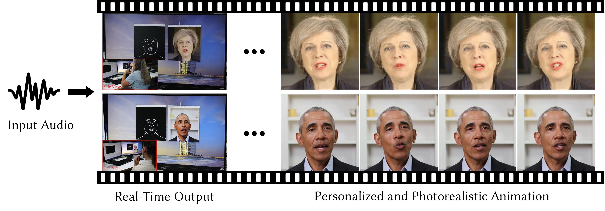

# Live Speech Portraits: Real-Time Photorealistic Talking-Head Animation

This repository contains the implementation of the following paper:

> **Live Speech Portraits: Real-Time Photorealistic Talking-Head Animation**
>
> Yuanxun Lu, [Jinxiang Chai](https://scholar.google.com/citations?user=OcN1_gwAAAAJ&hl=zh-CN&oi=ao), [Xun Cao](https://cite.nju.edu.cn/People/Faculty/20190621/i5054.html) *(SIGGRAPH Asia 2021)*
>
> **Abstract**: To the best of our knowledge, we first present a live system that generates personalized photorealistic talking-head animation only driven by audio signals at over 30 fps. Our system contains three stages. The first stage is a deep neural network that extracts deep audio features along with a manifold projection to project the features to the target person's speech space. In the second stage, we learn facial dynamics and motions from the projected audio features. The predicted motions include head poses and upper body motions, where the former is generated by an autoregressive probabilistic model which models the head pose distribution of the target person. Upper body motions are deduced from head poses. In the final stage, we generate conditional feature maps from previous predictions and send them with a candidate image set to an image-to-image translation network to synthesize photorealistic renderings. Our method generalizes well to wild audio and successfully synthesizes high-fidelity personalized facial details, e.g., wrinkles, teeth. Our method also allows explicit control of head poses. Extensive qualitative and quantitative evaluations, along with user studies, demonstrate the superiority of our method over state-of-the-art techniques.
>
> [[Project Page]](https://yuanxunlu.github.io/projects/LiveSpeechPortraits/)    [[Paper]](https://yuanxunlu.github.io/projects/LiveSpeechPortraits/resources/SIGGRAPH_Asia_2021__Live_Speech_Portraits__Real_Time_Photorealistic_Talking_Head_Animation.pdf)    [[Arxiv]](https://arxiv.org/abs/2109.10595)    [[Web Demo]](https://replicate.ai/yuanxunlu/livespeechportraits)



Figure 1. Given an arbitrary input audio stream, our system generates personalized and photorealistic talking-head animation in real-time. Right: May and Obama are driven by the same utterance but present different speaking characteristics.

<a href="https://replicate.ai/yuanxunlu/livespeechportraits"></a>


## Requirements

- This project is successfully trained and tested on Windows10 with PyTorch 1.7 (Python 3.6).  Linux and lower version PyTorch should also work (not tested). We recommend creating a new environment:

```
conda create -n LSP python=3.6
conda activate LSP
```

- Clone the repository:

```
git clone https://github.com/YuanxunLu/LiveSpeechPortraits.git
cd LiveSpeechPortraits
```

- FFmpeg is required to combine the audio and the silent generated videos. Please check [FFmpeg](http://ffmpeg.org/download.html) for installation. For Linux users,  you can also:

```
sudo apt-get install ffmpeg
```

- Install the dependences:

```
pip install -r requirements.txt
```


## Demo

- Download the pre-trained models and data from [Google Drive](https://drive.google.com/drive/folders/1sHc2xEEGwnb0h2rkUhG9sPmOxvRvPVpJ?usp=sharing) to the `data` folder.  Five subjects data are released (May, Obama1, Obama2, Nadella and McStay).

- Run the demo:

  ```
  python demo.py --id May --driving_audio ./data/Input/00083.wav --device cuda
  ```

  Results can be found under the `results` folder.

- **(New!) Docker and Web Demo**

  We are really grateful to [Andreas](https://github.com/andreasjansson) from [Replicate](https://replicate.ai/home) for his amazing job to make the web demo! Now you can run the [Demo](https://replicate.ai/yuanxunlu/livespeechportraits) on the browser.
  
- **For the orginal links of these videos, please check issue [#7](https://github.com/YuanxunLu/LiveSpeechPortraits/issues/7).**

  


## Citation

If you find this project useful for your research, please consider citing:

```
@article{lu2021live,
 author = {Lu, Yuanxun and Chai, Jinxiang and Cao, Xun},
 title = {{Live Speech Portraits}: Real-Time Photorealistic Talking-Head Animation},
 journal = {ACM Transactions on Graphics},
 numpages = {17},
 volume={40},
 number={6},
 month = December,
 year = {2021},
 doi={10.1145/3478513.3480484}
} 
```


## Acknowledgment

- This repo was built based on the framework of [pix2pix-pytorch](https://github.com/junyanz/pytorch-CycleGAN-and-pix2pix).
- Thanks the authors of [MakeItTalk](https://github.com/adobe-research/MakeItTalk), [ATVG](https://github.com/lelechen63/ATVGnet), [RhythmicHead](https://github.com/lelechen63/Talking-head-Generation-with-Rhythmic-Head-Motion), [Speech-Driven Animation](https://github.com/DinoMan/speech-driven-animation) for making their excellent work and codes publicly available.
- Thanks [Andreas](https://github.com/andreasjansson) for the efforts of the web demo.


